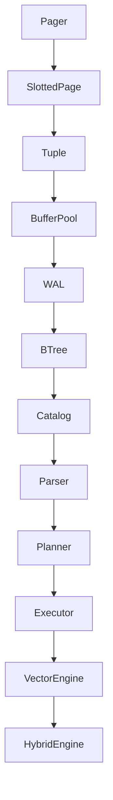

# HybridDB Architecture

HybridDB is a unified relational and vector database engine built from scratch. It is designed primarily for educational purposes and observability.

## High-Level Dependency Graph

## Phase Exit Conditions

A phase is considered complete and eligible for exit only when:
- The required functionality is fully implemented.
- The Go compiler succeeds (`make build`).
- `golangci-lint` passes with 0 warnings (`make lint`).
- Property and unit tests all pass (`make test`).
- Integration/crash recovery tests succeed (`make test-integration`).
- Invariant assertions are passing.

## Engineering Invariants & Forbidden Shortcuts
- **WAL-before-data rule**: WAL records must be flushed to disk before the corresponding dirty pages are evicted from the Buffer Pool.
- **Fail Loudly**: No silent fallback mechanisms for disk or memory corruption.
- **Single-Threaded**: V1 operates sequentially.
- **Interfaces before Implementation**: Abstract contracts govern boundary communication.

## Subsystems

- **internal/bufferpool**: Manages memory limits, evicting pages (LRU).
- **internal/wal**: Guarantees durability, logging operations.
- **internal/storage**: Contains Pager (I/O), Slotted Pages (binary layouts), and Tuples.
- **internal/executor**: Pull-based Volcano iterator execution engine.
- **internal/vector**: Embedding HTTP clients and cosine-similarity searches.
